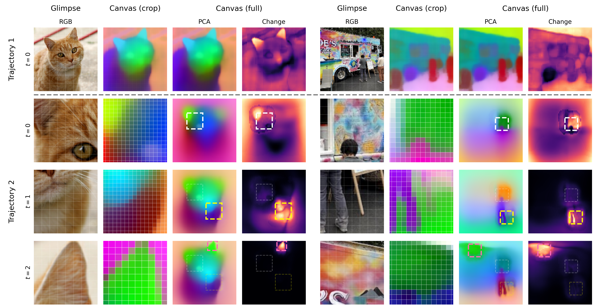

# CanViT

<p align="center">
  
</p>

_[CanViT: Toward Active-Vision Foundation Models](https://arxiv.org/abs/2603.22570) (arXiv:2603.22570)_

**Yohaï-Eliel Berreby, Sabrina Du, Audrey Durand, B. Suresh Krishna**

Reference PyTorch implementation of CanViT, the Canvas Vision Transformer — **and
everything that trains and evaluates it.** The model lives in
[`canvit/core/`](canvit/core/); pretraining, downstream probes and finetunes, viewpoint-policy
RL and standalone evaluation live alongside it behind one harness.

### News

- **2026-04-06**: First finetuned IN1k checkpoint: [`canvitb16-add-vpe-finetune-g128px-s512px-in1k-2026-04-06`](https://huggingface.co/canvit/canvitb16-add-vpe-finetune-g128px-s512px-in1k-2026-04-06), with new `CanViTForImageClassification` API.
  - 🎉 CanViT sets a new SOTA on **active-vision IN1k classification**, with **84.5% top-1 accuracy**, up from [AdaptiveNN](https://github.com/LeapLabTHU/AdaptiveNN)'s previous best of 82.2%.
- **2026-03-23**: Preprint v1 ([arXiv:2603.22570](https://arxiv.org/abs/2603.22570)).
  - 🎉 CanViT sets a new SOTA on **active ADE20K segmentation**, with **45.9% ADE20K mIoU**, obtained using linear probing from frozen weights.
- **2026-02-18**: Initial code and [first pretrained checkpoint](https://huggingface.co/canvit/canvitb16-add-vpe-pretrain-g128px-s512px-in21k-dv3b16-2026-02-02) release.

---

CanViT is a scalable recurrent architecture for fine-grained vision, and the first **Active-Vision Foundation Model (AVFM)**: a foundation model for active vision that is both task-agnostic and policy-agnostic.

CanViT processes scenes through sequences of localized glimpses, integrating observations over time into a persistent scene-wide latent workspace — the **canvas** — via **Canvas Attention**, an efficient asymmetric cross-attention mechanism which is based on Scene-Relative Rotary Position Embeddings and eliminates canvas-side QKVO projections.

CanViT-B is pretrained on 1 billion glimpses taken from 13.2 million ImageNet-21k scenes, via **policy-agnostic passive-to-active dense distillation** from a frozen high-resolution DINOv3 ViT-B teacher, without human annotations.

CanViT's scene-wide output features at each timestep are linearly decodable into dense predictions without post-hoc upscaling; a frozen-weights CanViT-B evaluated with linear probing outperforms all prior dense active vision models by a wide margin on ADE20K scene parsing, at a fraction of the cost, while offering significantly greater flexibility.

CanViT generalizes natively across policies, sequence length, glimpse size and canvas size, enabling high-resolution and long-horizon continual pretraining alongside task-specific policy learning.

CanViT enables low-latency high-resolution dense vision, running at hundreds of sequential frames per second on commodity hardware.

## Checkpoints

We release checkpoints on HuggingFace under the [`canvit`](https://huggingface.co/canvit) namespace.

| Checkpoint | Description |
|------------|-------------|
| [`canvitb16-add-vpe-pretrain-g128px-s512px-in21k-dv3b16-2026-02-02`](https://huggingface.co/canvit/canvitb16-add-vpe-pretrain-g128px-s512px-in21k-dv3b16-2026-02-02) | Pretrained on IN21k via dense distillation from DINOv3 |
| [`canvitb16-add-vpe-finetune-g128px-s512px-in1k-2026-04-06`](https://huggingface.co/canvit/canvitb16-add-vpe-finetune-g128px-s512px-in1k-2026-04-06) | Finetuned for ImageNet-1k classification (trained on TPU v6e via [torch_xla](https://github.com/pytorch/xla)) |

## Quickstart

Set the environment up as in [Setup](#setup) below, then:

```python
from canvit.core import CanViTForPretrainingHFHub, Viewpoint, sample_at_viewpoint
from canvit.core.preprocess import preprocess
from PIL import Image
import torch

# CanViT is integrated with the HuggingFace Hub.
model = CanViTForPretrainingHFHub.from_pretrained(
    "canvit/canvitb16-add-vpe-pretrain-g128px-s512px-in21k-dv3b16-2026-02-02"
).eval()

# Replace with the image of your choice
image = Image.open("test_data/Cat03.jpg").convert("RGB")
image = preprocess(512)(image)
image = image.unsqueeze(0)  # [1, 3, 512, 512]

# CanViT is a recurrent model.
state = model.init_state(batch_size=1, canvas_grid_size=32)

# Let's process a first glimpse: centered, zoomed-out.
# You can use any viewpoint you like, as long as it is within bounds.
# CanViT was trained on viewpoints covering 0.25% to 100%
# of a scene's surface area.
with torch.inference_mode():
    vp = Viewpoint.full_scene(batch_size=1, device=image.device)
    glimpse = sample_at_viewpoint(spatial=image, viewpoint=vp, glimpse_size_px=128)
    out = model(image=glimpse, state=state, viewpoint=vp)

# Let's inspect the structure of what we get back.
# The canvas contains the model's working understanding of
# the scene at any given time, and is linearly decodable
# into dense predictions upon token-wise LayerNorm.
# See `demos/basic.py` for how to visualize the canvas.
canvas_spatial = model.get_spatial(out.state.canvas)  # [1, 1024, 1024]
canvas_spatial = canvas_spatial.unflatten(1, (32, 32))  # [1, 32, 32, 1024] — spatial feature map
out.state.recurrent_cls  # [1, 1, 768] — global CLS token
out.local_patches        # [1, 64, 768] — glimpse patch features

# Now let's do a second glimpse: zoom into the top-left quadrant
# You can do this repeatedly: CanViT is recurrent with a large but constant-size canvas.
with torch.inference_mode():
    vp2 = Viewpoint(centers=torch.tensor([[-.5, -.5]]), scales=torch.tensor([.5]))
    glimpse2 = sample_at_viewpoint(spatial=image, viewpoint=vp2, glimpse_size_px=128)
    out2 = model(image=glimpse2, state=out.state, viewpoint=vp2)

# You can use CanViT with frozen weights, fine-tune it, learn a policy on top...
# Or pretrain your own; it's fast.
# Start building!
```

> **The pretraining model's forward takes `image=`**, while the classification and
> segmentation wrappers below take `glimpse=`. Both are keyword-only, so mixing them up is
> a `TypeError` rather than a silent bug.

### ImageNet-1k classification

`CanViTForImageClassification` provides a unified interface for classification. Two construction paths, same forward pass:

**From a finetuned checkpoint** (CanViT + head trained on IN1k):

```python
from canvit.core import CanViTForImageClassification, Viewpoint, sample_at_viewpoint
from canvit.core.preprocess import preprocess
from PIL import Image
import torch

clf = CanViTForImageClassification.from_pretrained(
    "canvit/canvitb16-add-vpe-finetune-g128px-s512px-in1k-2026-04-06"
).eval()
```

**From the frozen pretrained CanViT checkpoint + a [DINOv3 linear probe](https://huggingface.co/canvit/dinov3-vitb16-lvd1689m-in1k-512x512-linear-clf-probe)**:

```python
clf = CanViTForImageClassification.from_pretrained_with_probe(
    pretrained_repo="canvit/canvitb16-add-vpe-pretrain-g128px-s512px-in21k-dv3b16-2026-02-02",
    probe_repo="canvit/dinov3-vitb16-lvd1689m-in1k-512x512-linear-clf-probe",
).eval()
```

**Both have the same forward pass:**

```python
image = preprocess(512)(Image.open("test_data/Cat03.jpg").convert("RGB")).unsqueeze(0)
state = clf.init_state(batch_size=1, canvas_grid_size=32)

with torch.inference_mode():
    vp = Viewpoint.full_scene(batch_size=1, device=image.device)
    glimpse = sample_at_viewpoint(spatial=image, viewpoint=vp, glimpse_size_px=128)
    logits, state = clf(glimpse=glimpse, state=state, viewpoint=vp)

print(logits.argmax(dim=-1))  # ImageNet-1k class index
```

### ADE20K semantic segmentation

`CanViTForSemanticSegmentation` bundles a CanViT and a `SegmentationProbe` head into one model. `forward` returns per-pixel logits at canvas-grid resolution; `predict` adds bilinear upsampling.

```python
from canvit.core import CanViTForSemanticSegmentation

# Frozen CanViT + the flagship ADE20K probe (45.9% mIoU, 1024px / 64x64 canvas):
seg = CanViTForSemanticSegmentation.from_pretrained_with_probe(
    pretrained_repo="canvit/canvitb16-add-vpe-pretrain-g128px-s512px-in21k-dv3b16-2026-02-02",
    probe_repo="canvit/probe-ade20k-40k-s1024-c64-in21k",
).eval()

state = seg.init_state(batch_size=1, canvas_grid_size=64)
logits, state = seg(glimpse=glimpse, state=state, viewpoint=vp)               # [B, n_cls, 64, 64]
upsampled, state = seg.predict(glimpse=glimpse, state=state, viewpoint=vp,
                               target_size=(1024, 1024))                       # [B, n_cls, 1024, 1024]
```

The standalone `SegmentationProbe` head is also exported from `canvit.core` for use on any spatial feature map. Published probes: [canvit ADE20K segmentation probes collection](https://huggingface.co/collections/canvit/canvit-ade20k-segmentation-probes).

## Demos

```bash
# Classification with sequential glimpses
.venv/bin/python demos/classify.py                # finetuned checkpoint
.venv/bin/python demos/classify.py --mode frozen  # frozen CanViT + fused probe

# Canvas PCA visualization with two viewing strategies
.venv/bin/python demos/basic.py
```

`demos/basic.py` needs the `demo` extra (`uv sync --extra demo`) for scikit-learn.

## Supported platforms

- **CPU**
- **CUDA** (tested on RTX 4090, H100 SXM 80GB, A100 80GB incl. MIG slices)
- **TPU** via [torch_xla](https://github.com/pytorch/xla) 2.9.0 (tested on TPU v6e) — for the
  model only; the training harness here is CUDA/CPU.

We aim to maintain compatibility with [`torch.export`](https://docs.pytorch.org/docs/stable/user_guide/torch_compiler/export.html) and [ONNX Runtime](https://onnxruntime.ai/).

`bench/pt/` holds the inference benchmark (`run.py`, `matrix.py`, `analyze.py`) and the
committed baselines it compares against.

## What this repo trains

Three training objectives, one unified framework and one entry point:

| task | what it trains | data |
|---|---|---|
| `distill` | passive→active dense latent distillation from [DINOv3](https://github.com/facebookresearch/dinov3) ([arXiv:2508.10104](https://arxiv.org/abs/2508.10104)) — the pretraining objective | ImageNet-21k WebDataset shards + a validation image folder |
| `ade20k` | ADE20K semantic-segmentation probe / finetune | ADE20K (`$ADE20K_ROOT`) |
| `in1k` | ImageNet-1k linear probe / full finetune | ImageNet-1k WebDataset + validation image folder |

On top of any of the three, the *viewpoint-selection policy* — the network that
decides where the model looks next — can be trained by reinforcement learning,
either alone against a frozen model or jointly with the task.

## Repository layout

Two repos are live:

```
repos/
├── fovi/               # foveated-vision library: cortical-magnification patch geometry
└── CanViT-train/       # this repo: the model + all training + all evaluation
```

The dependency direction is `fovi` → this repo. Each has its **own** uv-managed virtual
environment.

Three further clones are kept **read-only, as fallback references** — do not edit them, and
prefer this repo's equivalents:

| clone | superseded by | kept because |
|---|---|---|
| `CanViT-PyTorch/` | [`canvit/core/`](canvit/core/) | 116 launchers `git archive` a core commit out of its `.git` to pin long runs |
| `CanViT-eval/` | `canvit.harness.evaluate` | its `results/` are the historical record (its `reconstruction` task's `*_cos_raw` numbers are wrong — see its `ARCHIVED.md`) |
| `CanViT-specialize/`, `CanViT-PyTorch-RL/` | `canvit.{ade20k,in1k}`, `canvit.harness.policy` | pre-unification reference for the downstream and RL recipes |

## Setup

Clone the repos **as siblings in one parent folder**, then create an environment:

```bash
# Default env (.venv) — CUDA-13.x torch, sm_90 (H100) and newer
uv sync

# Alternative env (.venv-cu126) — cu126 torch, keeps sm_70 (V100) support
UV_PROJECT_ENVIRONMENT=.venv-cu126 uv sync --no-group cuda --group cu126
```

The two are **conflicting, separately-locked resolutions** of the same project:
torch is pinned in the `cuda` (default) and `cu126` dependency groups in
`pyproject.toml`, so each `uv sync` is fully reproducible. The cu126 wheels still
ship sm_70 kernels, which the CUDA-13.x wheels dropped. Both share the same
`[tool.uv.sources]`.

`[tool.uv.sources]` links the one remaining sibling as a **relative-path editable install**
(`fovi = { path = "../fovi", editable = true }`). Relative paths resolve on any machine as
long as the repos are siblings, and the editable install means edits in the local `fovi`
clone take effect immediately. To install *without* the sibling present, point that entry at
the remote instead — `fovi = { git = "https://github.com/jonaden94/fovi.git" }` — and
`uv sync`.

Until 2026-09-03 the model was a second sibling (`canvit-pytorch = { path =
"../CanViT-PyTorch", editable = true }`, with `fovi` arriving transitively through its
`[fovi]` extra). It is now `canvit/core/` in this repo, so that source is gone and `fovi` is
declared here directly.

### Environment variables

Training needs the dataset roots, the cache directories, and a place to write run
artifacts. **For compute project `nib00021` on the Grete cluster (GWDG, Göttingen)
these are already filled in, in `.envrc.grete`** — its paths are that project's
storage, so they apply to that project and not to Grete in general. `slurm/env.sh`
sources the file directly (along with the GWDG proxy that compute nodes need for
HuggingFace Hub access), so submitting a run needs no `direnv` and no path hunting.
The launchers likewise hardcode `#SBATCH -A nib00021` and the `grete:shared`
partition; change both if you belong to a different project.

For **interactive** work on a login node — running the tests, publishing a
checkpoint, inspecting one, or launching training outside SLURM — nothing sources
that file for you, so load it into your shell. With
[direnv](https://direnv.net/), which auto-loads `.envrc` on entering the
directory:

```bash
cp .envrc.grete .envrc && direnv allow   # project nib00021 on Grete
cp .envrc.example .envrc && direnv allow # elsewhere, then edit for your machine
```

Or just `source .envrc.grete` in the shell you are working in.

The variables that matter:

| variable | used for |
|---|---|
| `LOGS_DIR` | root for run artifacts: `$LOGS_DIR/<run_group>/<run_name>/` |
| `WEBDATASET_DIR`, `VAL_DIR` | `distill` training shards and validation images |
| `VAL_INDEX_DIR` | cache for the validation-image index (the directory scan runs once, then is reused) |
| `ADE20K_ROOT` | ADE20K `ADEChallengeData2016` directory |
| `IN1K_TRAIN_DIR`, `IN1K_VAL_DIR` | ImageNet-1k shards and validation images |
| `HF_HOME`, `HF_TOKEN` | HuggingFace cache and access (teacher weights, pretrained CanViT and probe checkpoints) |
| `WANDB_DIR` | where Weights & Biases writes its run files |
| `WANDB_PROJECT`, `WANDB_ENTITY` | fallback project / entity for the tracker |

In `.envrc.grete` the dataset paths are **shared**: they live under the project
directory (`/mnt/vast-nhr/projects/nib00021`) or the project's lustre workspace,
both group-readable, so any member of the project uses them unchanged. The caches
derive from `$HOME`, so they are already per-user.

#### First-time setup for a new member of project `nib00021`

Two things are personal and must be set up once:

1. **Point `LOGS_DIR` and `WANDB_DIR` at a directory you own.** These are run
   *outputs*, and the defaults in `.envrc.grete` are group-readable but writable
   only by their owner. The project root `/mnt/vast-nhr/projects/nib00021` *is*
   group-writable, so create your own subdirectory there and point both at it.
2. **Log in to the two services**, whose credentials are per-user:

   ```bash
   hf auth login   # writes $HF_HOME/token, which .envrc.grete picks up as HF_TOKEN
   wandb login
   ```

Nothing else needs adapting: with an empty `WANDB_ENTITY` runs land in your own
W&B account, and every dataset path is already shared.

`distill` requires `WEBDATASET_DIR` and `VAL_DIR`. The `ade20k` root comes from
`ADE20K_ROOT`, and the `in1k` roots fall back to a shared path when
`IN1K_TRAIN_DIR` / `IN1K_VAL_DIR` are unset — so outside project `nib00021`, set
all of them.

Metrics go to Weights & Biases by default; `--cfg.tracker none` is also possible.

## Datasets

`distill` and `in1k` read [WebDataset](https://github.com/webdataset/webdataset)
tar shards, which are assumed to have been built already and are pointed at with
`--cfg.webdataset-dir`. Distillation shards come in two flavours and both are
handled automatically:

- **with precomputed features** — each sample carries the DINOv3 teacher's `cls`
  and dense patch targets, so no teacher forward is needed at train time;
- **raw images** — a frozen DINOv3 teacher is loaded and produces the targets on
  the fly, both for the target standardizers and for every batch.

ADE20K is read from the extracted `ADEChallengeData2016` directory
(`$ADE20K_ROOT`), and ImageNet-1k validation from a standard class-per-folder
image directory.

## Package layout

One rule: **`harness/` holds the entry point and everything shared by more than
one task; each task folder holds only what is specific to that task.**

```
canvit/
├── core/             THE MODEL — canvas ViT, patchers, HF-hub classes, probes, teacher
├── harness/          the entry point + every shared primitive
│   ├── run.py        process entry point
│   ├── cli.py        tyro CLI; task × --preset → TrainSpec
│   ├── loop.py       training loop: cadence, validation, checkpointing
│   ├── spec.py       TrainSpec / BpttSpec / GroupOptim + validation
│   ├── config.py     config every task shares (foveated view-scale law, RL recipe)
│   ├── rollout/      batch → glimpse sequence: engine, viewpoint, selector, eval viewpoints
│   ├── policy/       learned viewpoint policy: builder, joint task+policy, RL objectives
│   ├── optim/        optimizer construction, LR schedules, EMA
│   ├── infra/        checkpoint I/O, best-metric tracker, DDP, SLURM shard schedule, utils
│   └── viz/          task-agnostic PCA / figure-writing / metric leaves
├── distill/          DINOv3 latent distillation: loss, student model, probe, data/, viz/
├── ade20k/           ADE20K segmentation: data, metrics, rollout, viz
├── in1k/             ImageNet-1k: data, metrics, model, eval, rollout
└── checkpoint/       checkpoint I/O and `to_hf` — publishing to the HF-hub layout
```

`core/` is the model and is the layer everything else sits on: `model/` (pretraining,
classification, segmentation wrappers + the HF-hub mixin), `patcher/` (uniform, foveated,
square), `backbone/`, `teacher/`, `probes/`, `policies/`, `policy/` (the learned scorer net),
`viewpoint/`, `rope/`, `preprocess/`, `standardizers/`, `metrics.py`, `data/`. Nothing in
`core/` may import from `harness/`, `distill/`, `ade20k/` or `in1k/` — one grep checks it:

```bash
grep -rn "from canvit\.\(harness\|distill\|ade20k\|in1k\)" canvit/core/
```

The five flat files in `harness/` are the ones to read first; the subpackages are
the machinery. Every task folder has the same shape: `task.py` (the adapter the
framework calls — build model, build loaders, evaluate, visualize), `config.py`
(that task's knobs), plus its own data / metrics / rollout helpers.

## Running a training job

**There is one training entry point.** Every task and every configuration goes
through it:

```bash
python -m canvit.harness.run <task> --preset <preset> [--cfg.* ...] [--opts.* ...]
```

`<task>` is `distill`, `ade20k`, or `in1k`. `--preset` picks *what trains*,
orthogonally to the task:

| preset | trains |
|---|---|
| `default` | the task's own recipe (its tuned LR schedule) |
| `probe` | head only, backbone frozen |
| `finetune` | backbone + head |
| `policy_only` | the viewpoint-selection policy only, everything else frozen |
| `joint` | task and policy together |

Not every combination is meaningful (`distill` has no head, so `--preset probe`
is refused). **`unification_docs/capability_matrix.md` is generated from the live
task objects** and lists exactly which task/preset combinations exist and what
each resolves to — read it rather than guessing, and regenerate it with
`unification_docs/capability_matrix.py` after changing a `default_spec`.

`--cfg.*` are the task's own knobs (see the `Config` dataclass in the task's
`config.py`); `--opts.*` are the framework's (run identity, cadence, checkpoint
paths). `--help` on any task prints the full, documented flag surface.

### Run artifacts

Each run writes everything under one directory derived from its identity:

```
$LOGS_DIR/<run_group>/<run_name>/
├── checkpoints/      step-<N>.pt, best.pt, latest.pt (symlink to the newest)
├── log/              SLURM job logs
└── visualization/    figures, written locally and never uploaded
```

Start-up mode is decided by priority **resume > seed > fresh**. `--opts.resume`
continues a run with its optimizer, scheduler and data schedule intact (the
default for `distill`, whose array tasks must chain; off by default for the
downstream tasks). Seeding instead loads *weights only* and starts a new run at
step 0 with a fresh optimizer and schedule: `--cfg.seed-ckpt` from a local
checkpoint or `--cfg.hf-seed-ckpt` from the HuggingFace Hub for `distill`, and
`--cfg.model-repo` for `ade20k` / `in1k`, which always start from a published
pretrained model. With neither, training starts from scratch.

### On SLURM

`slurm/harness_train.sbatch` runs any task on one node with one or more GPUs.
All variation comes from environment variables, so the same script serves every
run:

| variable | meaning |
|---|---|
| `TASK` | `distill` \| `ade20k` \| `in1k` |
| `RUN_GROUP`, `RUN_NAME` | run identity → the artifact directory and the tracker run name |
| `NGPU` | GPUs per node (`ade20k` is single-GPU only) |
| `CFG_FOO_BAR=v` | becomes `--cfg.foo-bar v` |
| `OPT_FOO_BAR=v` | becomes `--opts.foo-bar v` |
| `EXTRA_ARGS` | verbatim extra flags — the only way to reach nested config trees such as `--cfg.model.patcher-name foveated`, since `FOO_BAR` cannot encode a dot |

Jobs run in `.venv-cu126`, and the launcher fails immediately with the `uv sync`
command to run if that environment is missing.

**Set the W&B project per run, not globally.** `$WANDB_PROJECT` is only a
fallback; each launcher sets `CFG_WANDB_PROJECT` to its own run group, so a
campaign's runs stay together and separate from everything else:

```bash
CFG_WANDB_PROJECT=my_ablation_study   # set in slurm/runs/<group>/*.sh
```

Note the W&B entity may be a **shared** one. If so, pick a project name nobody
else is using, and keep figures off the tracker — the framework writes them to
`run_dir/visualization/` on local disk rather than uploading them.

Long runs are split into a SLURM **array**, each task resuming where the last
left off. The array is a *budget*, not a schedule: the step count advances only
for tasks that succeed, so a failed task costs steps rather than skipping data.

To launch a run, copy an existing launcher from `slurm/runs/<group>/` and edit
it. Each is a small self-documenting shell script that sets the variables above
and calls `sbatch`.

### Pinning code for long runs

A training run can take days, during which the local clones may keep changing —
but a single run must use **one** fixed version of the code. The launchers
therefore pin each repo to an exact commit:

```bash
TRAIN_COMMIT=<sha>     # this repo — the model AND the trainer
FOVI_COMMIT=<sha>      # fovi
```

`harness_train.sbatch` extracts those commits with an offline `git archive`
(local object store only — no network, no SSH, works for private repos) into the
job's `TMPDIR` and prepends them to `PYTHONPATH` with `PYTHONSAFEPATH=1`, so the
snapshot **overrides** the editable install for that job. A submitted job is
therefore immune to later edits or pulls of the clones. The three variables are
optional and independent; omit them to use the environment's editable install.

Two legacy spellings are still accepted, because dropping either would leave old launchers
running the editable install with no error at all:

- **`PRETRAIN_COMMIT`** — what `TRAIN_COMMIT` was called before this repo was renamed.
  Around 48 launchers under `slurm/` use it to reproduce older experiments.
- **`PYTORCH_COMMIT`** — pinned the model when it was a separate repo, before the
  2026-09-03 core merge. Around 116 launchers set it. For those, it is still load-bearing:
  their pinned `TRAIN_COMMIT` predates the merge, so its code imports the top-level
  `canvit_pytorch`, which only that snapshot supplies. **New launchers must not set it** —
  `TRAIN_COMMIT` now pins the model too, and `PYTORCH_COMMIT` would have no effect.

`harness_train.sbatch` works out which side of the merge the pinned snapshot is on and says
so, warning in the two cases where the model silently is not pinned. An old
`CanViT-PyTorch` snapshot cannot shadow a post-merge `canvit/core/` — the top-level names
differ, so `PYTHONPATH` order does not matter.

## Publishing a checkpoint

Conversion to the HuggingFace-hub layout is always explicit, never automatic:

```bash
python -m canvit.checkpoint.to_hf --pt-path <run>/checkpoints/best.pt --out-dir <dir>
```

It detects the checkpoint type: a `distill` checkpoint becomes the pretraining
layout (`CanViTForPretrainingHFHub`), an `in1k` one the classifier layout
(`CanViTForImageClassification`). Segmentation heads alone go through
`canvit.checkpoint.probe_to_hf`.

## Evaluating a checkpoint

**There is one evaluation entry point**, and it shares the validation loader and the
`evaluate` step with training-time validation, so the two cannot drift:

```bash
python -m canvit.harness.evaluate <distill|ade20k|ade20k-dinov3|in1k> \
    --opts.ckpt <run>/checkpoints/best.pt --opts.out <out>.json --cfg.eval-policy <policy>
```

One config per invocation, one JSON artifact, and the resolved protocol recorded in every
record. `--cfg.eval-policy` is **required** — there is no `auto` guess, because the adequate
protocol depends on how the model was trained and is the caller's decision. Presets exist for
the sensible ones (`fixation_grid`, `full`, `random`, `coarse_to_fine`, `fine_to_coarse`), and
any combination of the underlying axes can still be given explicitly.

A foveated model is only in-distribution at the view scale it was trained at, so pin it
(`--cfg.foveated-scale.fixed-scale`); off-scale glimpses make the metric *fall* as glimpses
accumulate. The command warns when the generated scales look off-distribution.

Details, and every defect found while unifying the two eval paths:
[`unification_docs/20-eval-merge.md`](unification_docs/20-eval-merge.md).

## Tests

```bash
.venv-cu126/bin/python -m pytest canvit
```

493 tests: the model (`canvit/core/`), the rollout engine, specification resolution, the RL
objectives, each task's adapter, checkpoint round-trips, and the import-provenance guards.
They run on CPU — use `.venv-cu126`, since the **digest tests** pin CPU numerics against
hashes recorded under that torch build and a different build fails them.

Those digest tests hash a short training run's loss stream *and* a fingerprint of every
parameter after N optimizer steps, so a change that perturbs training numerics — or gradient
flow, even where step 0's loss is untouched — fails loudly instead of silently. They are
**pinning** digests, not a correctness claim: they assert only that today's numbers equal the
numbers recorded when they were written.

## Further documentation

[`readme_docs/`](readme_docs/) holds procedures for specific training campaigns —
what they train, how to launch them, and how to judge the results:

- [`readme_docs/verification_runs.md`](readme_docs/verification_runs.md) — the
  exp32–exp35 campaign: pretraining with a learning-rate drop, ImageNet-1k
  finetunes, ADE20K probes, and 10 seeds of viewpoint-policy training, each
  checked against an established expected result.
- [`readme_docs/q_policy_foveated.md`](readme_docs/q_policy_foveated.md) —
  training the Q viewpoint policy for a **foveated** model, and the three
  settings that fail silently if they do not match the backbone/probe pair.
  Not yet run end to end: every Q-policy result so far is on a uniform
  backbone.

`unification_docs/` holds design notes and the generated capability matrix. Two entries there
are the record of how this repo came to hold everything:
[`20-eval-merge.md`](unification_docs/20-eval-merge.md) (evaluation) and
[`21-core-merge.md`](unification_docs/21-core-merge.md) (the model).

### Other implementations

- [CanViT-MLX](https://github.com/yberreby/CanViT-MLX) — MLX implementation for Apple Silicon (experimental)
- [CanViT-NNX](https://github.com/yberreby/CanViT-NNX) — JAX/Flax NNX implementation (experimental)

## Troubleshooting

**Errors loading a pretrained checkpoint** usually mean the model code and the checkpoint
disagree. Re-sync the environment (`uv sync`) so `canvit/core/` and `fovi` are current.

**`ModuleNotFoundError: canvit_pytorch`** means you are running code written against the
pre-2026-09-03 layout. The model is `canvit.core` now; the old top-level package exists only
in the read-only `CanViT-PyTorch` clone that the pinned launchers archive from.

**A pinned SLURM run using unexpected model code.** `harness_train.sbatch` prepends each
pinned snapshot to `PYTHONPATH`, and a `CanViT-PyTorch` snapshot shadows a post-merge
`canvit/core/`. That is correct when reproducing an old run and wrong for a new one; the
launcher logs which package it resolved. See
[`unification_docs/21-core-merge.md`](unification_docs/21-core-merge.md) §4.

## Citation

```bibtex
@article{berreby2026canvit,
  title={CanViT: Toward Active-Vision Foundation Models},
  author={Berreby, Yoha{\"i}-Eliel and Du, Sabrina and Durand, Audrey and Krishna, B. Suresh},
  year={2026},
  eprint={2603.22570},
  archivePrefix={arXiv},
  primaryClass={cs.CV},
  url={https://arxiv.org/abs/2603.22570}
}
```

## Contact

Open an issue in this repository, or email me@yberreby.com.

## License

MIT. See [LICENSE](LICENSE) for details.
